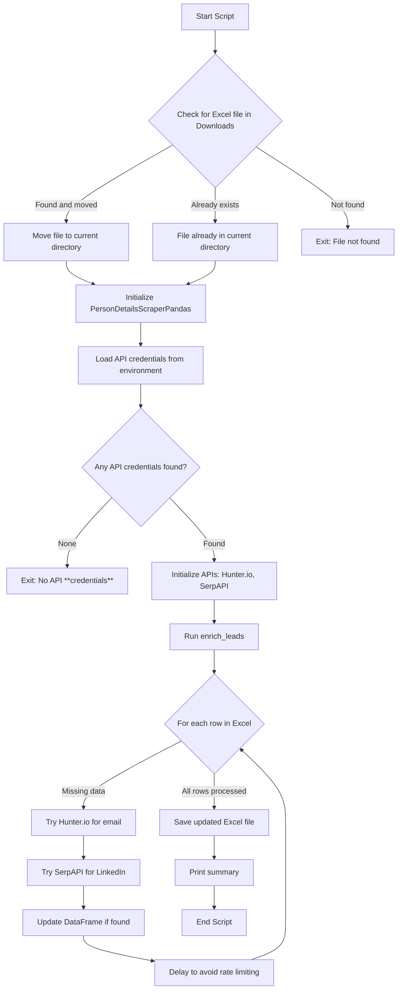

```mermaid
flowchart TD
    A[Start Script] --> B{Check for Excel file in Downloads}
    B -- Found and moved --> C[Move file to current directory]
    B -- Already exists --> D[File already in current directory]
    B -- Not found --> E[Exit: File not found]
    C --> F[Initialize PersonDetailsScraperPandas]
    D --> F
    F --> G[Load API credentials from environment]
    G --> H{Any API credentials found?}
    H -- None --> I[Exit: No API **credentials**]
    H -- Found --> J[Initialize APIs: Hunter.io, SerpAPI]
    J --> K[Run enrich_leads]
    K --> L{For each row in Excel}
    L -- Missing data --> M[Try Hunter.io for email]
    M --> N[Try SerpAPI for LinkedIn]
    N --> O[Update DataFrame if found]
    O --> P[Delay to avoid rate limiting]
    P --> L
    L -- All rows processed --> Q[Save updated Excel file]
    Q --> R[Print summary]
    R --> S[End Script]

    click A call linkCallback("/Users/jerichowenzel/Desktop/python_assessment_va/main.py#L1")
    click B call linkCallback("/Users/jerichowenzel/Desktop/python_assessment_va/main.py#L40")
    click C call linkCallback("/Users/**jerichowenzel**/Desktop/python_assessment_va/main.py#L41")
    click D call linkCallback("/Users/jerichowenzel/Desktop/python_assessment_va/main.py#L43")
    click E call linkCallback("/Users/jerichowenzel/Desktop/python_assessment_va/main.py#L45")
    click F call linkCallback("/Users/jerichowenzel/Desktop/python_assessment_va/main.py#L533")
    click K call linkCallback("/Users/jerichowenzel/Desktop/python_assessment_va/main.py#L562")
```