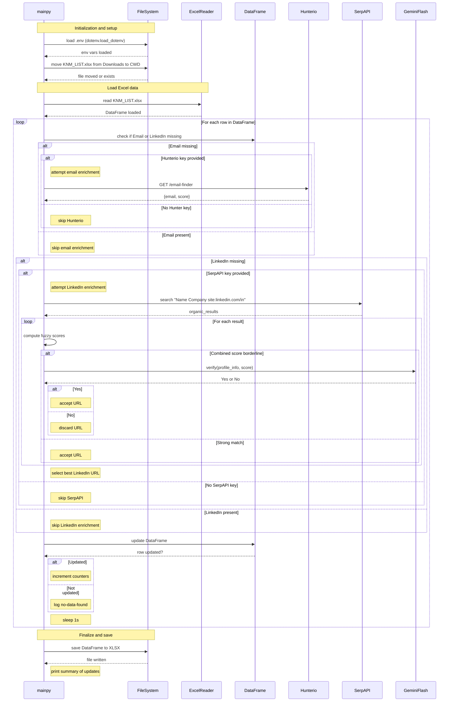

```mermaid
sequenceDiagram
    participant Script as mainpy
    participant FS as FileSystem
    participant Pandas as ExcelReader
    participant DF as DataFrame
    participant Hunter as Hunterio
    participant SerpAPI as SerpAPI
    participant Gemini as GeminiFlash

    Note over Script,FS: Initialization and setup
    Script->>FS: load .env (dotenv.load_dotenv)
    FS-->>Script: env vars loaded
    Script->>FS: move KNM_LIST.xlsx from Downloads to CWD
    FS-->>Script: file moved or exists

    Note over Script,Pandas: Load Excel data
    Script->>Pandas: read KNM_LIST.xlsx
    Pandas-->>Script: DataFrame loaded

    loop For each row in DataFrame
        Script->>DF: check if Email or LinkedIn missing
        alt Email missing
            alt Hunterio key provided
                Note right of Script: attempt email enrichment
                Script->>Hunter: GET /email-finder
                Hunter-->>Script: {email, score}
            else No Hunter key
                Note right of Script: skip Hunterio
            end
        else Email present
            Note right of Script: skip email enrichment
        end

        alt LinkedIn missing
            alt SerpAPI key provided
                Note right of Script: attempt LinkedIn enrichment
                Script->>SerpAPI: search "Name Company site:linkedin.com/in"
                SerpAPI-->>Script: organic_results
                loop For each result
                    Script->>Script: compute fuzzy scores
                    alt Combined score borderline
                        Script->>Gemini: verify(profile_info, score)
                        Gemini-->>Script: Yes or No
                        alt Yes
                            Note right of Script: accept URL
                        else No
                            Note right of Script: discard URL
                        end
                    else Strong match
                        Note right of Script: accept URL
                    end
                end
                Note right of Script: select best LinkedIn URL
            else No SerpAPI key
                Note right of Script: skip SerpAPI
            end
        else LinkedIn present
            Note right of Script: skip LinkedIn enrichment
        end

        Script->>DF: update DataFrame
        DF-->>Script: row updated?
        alt Updated
            Note right of Script: increment counters
        else Not updated
            Note right of Script: log no-data-found
        end

        Note right of Script: sleep 1s
    end

    Note over Script,FS: Finalize and save
    Script->>FS: save DataFrame to XLSX
    FS-->>Script: file written
    Note right of Script: print summary of updates
```