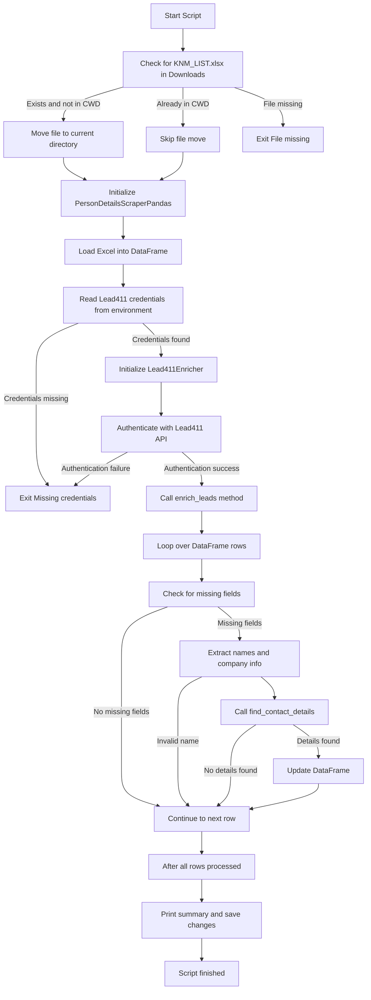

```mermaid
flowchart TD
    A[Start Script]
    A --> B[Check for KNM_LIST.xlsx in Downloads]
    B -->|Exists and not in CWD| C[Move file to current directory]
    B -->|Already in CWD| D[Skip file move]
    B -->|File missing| E[Exit File missing]
    C --> F[Initialize PersonDetailsScraperPandas]
    D --> F
    F --> G[Load Excel into DataFrame]
    G --> H[Read Lead411 credentials from environment]
    H -->|Credentials found| I[Initialize Lead411Enricher]
    H -->|Credentials missing| J[Exit Missing credentials]
    I --> K[Authenticate with Lead411 API]
    K -->|Authentication success| L[Call enrich_leads method]
    K -->|Authentication failure| J
    L --> M[Loop over DataFrame rows]
    M --> N[Check for missing fields]
    N -->|No missing fields| O[Continue to next row]
    N -->|Missing fields| P[Extract names and company info]
    P -->|Invalid name| O
    P --> Q[Call find_contact_details]
    Q -->|Details found| R[Update DataFrame]
    Q -->|No details found| O
    R --> O
    O --> S[After all rows processed]
    S --> T[Print summary and save changes]
    T --> U[Script finished]

    click F call linkCallback("/Users/jerichowenzel/Desktop/python_assessment_va/main.py#L358")
    click I call linkCallback("/Users/jerichowenzel/Desktop/python_assessment_va/main.py#L31")
    click L call linkCallback("/Users/jerichowenzel/Desktop/python_assessment_va/main.py#L407")
    click Q call linkCallback("/Users/jerichowenzel/Desktop/python_assessment_va/main.py#L341")
```