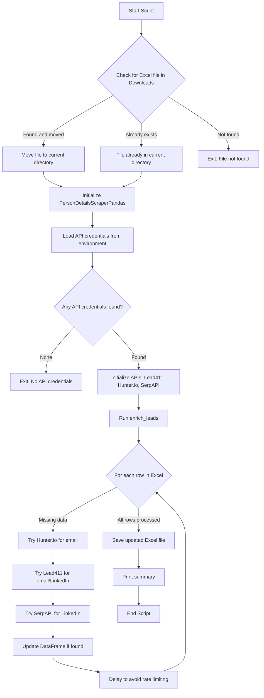
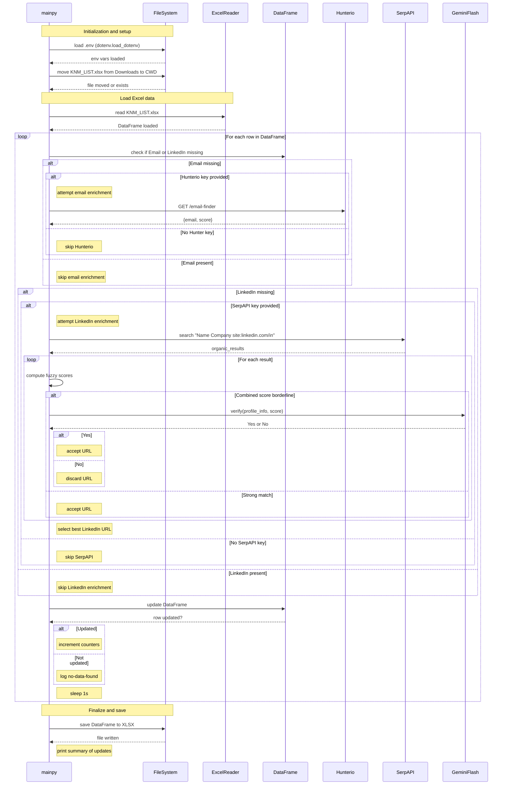

**# Lead Enrichment Automation

This project automates the enrichment of lead data in an Excel file by leveraging multiple APIs (Hunter.io, Lead411, SerpAPI, and Google Gemini). It fills in missing email addresses and LinkedIn profile URLs for contacts, using fuzzy matching and LLM verification for accuracy.

## Features

- **Automatic Excel File Handling:** Moves the target Excel file (`KNM_LIST.xlsx`) from your Downloads folder to the working directory if needed.
- **Flexible API Usage:** Supports enrichment via Hunter.io, Lead411, and SerpAPI, using whichever credentials are available.
- **Fuzzy Matching:** Uses fuzzy string matching to improve the reliability of LinkedIn profile matches.
- **LLM Verification:** Optionally verifies borderline LinkedIn matches using Google Gemini.
- **Safe Data Updates:** Only updates missing fields and saves changes to the Excel file.
- **Detailed Logging:** Prints a summary of all updates and actions taken.

## How It Works

1. **Initialization:**  
   Loads environment variables and checks for the Excel file.
2. **Data Loading:**  
   Reads the Excel file into a pandas DataFrame.
3. **Row-by-Row Enrichment:**  
   For each contact:
   - If email is missing, tries Hunter.io and/or Lead411.
   - If LinkedIn is missing, tries Lead411 and/or SerpAPI (with Gemini verification for borderline cases).
   - Updates the DataFrame if new data is found.
4. **Saving Results:**  
   Writes the updated DataFrame back to the Excel file and prints a summary.

## Flowchart



## Sequence Diagram



## Requirements

- Python 3.8+
- See [requirements.txt](requirements.txt) for dependencies.

## Setup

1. **Clone the repository and install dependencies:**
    ```sh
    pip install -r requirements.txt
    ```

2. **Prepare your `.env` file** with the following keys (see example below):
    ```
    HUNTER_API_KEY=your_hunter_api_key
    SERPAPI_API_KEY=your_serpapi_api_key
    GOOGLE_API_KEY=your_google_gemini_api_key
    LEAD411_EMAIL=your_lead411_email
    LEAD411_PASSWORD=your_lead411_password
    ```

3. **Place your `KNM_LIST.xlsx` file** in your Downloads folder (the script will move it automatically).

## Usage

Run the script:

```sh
python main.py
```

The script will:
- Move `KNM_LIST.xlsx` to the current directory if needed.
- Load API credentials from `.env`.
- Enrich missing emails and LinkedIn URLs.
- Save the updated Excel file.
- Print a summary of updates.

## File Structure

- `main.py`: Main script with all enrichment logic.
- `requirements.txt`: Python dependencies.
- `readme.md`: This documentation file with embedded diagrams.
- `KNM_LIST.xlsx`: Your input Excel file (not included in repo).

## Visuals

### Flowchart

(See Flowchart section above)

### Sequence Diagram

(See Sequence Diagram section above)

---

**Note:**
- The script requires at least one API credential to run (Hunter.io, Lead411, or SerpAPI).
- For best results, provide as many API keys as possible in your `.env` file.
**