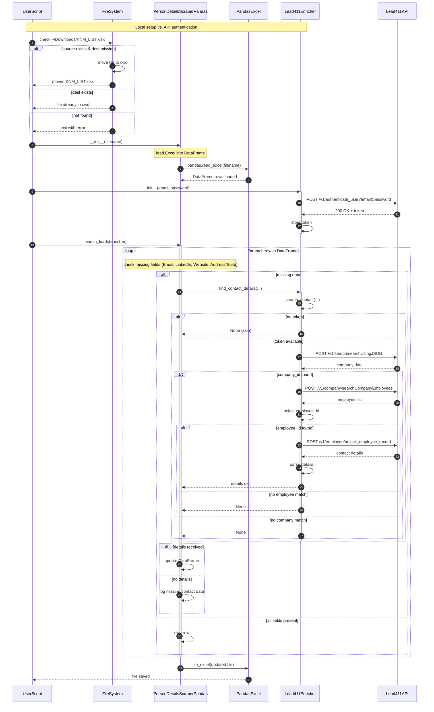

```mermaid
sequenceDiagram
    autonumber
    participant Script as UserScript
    participant FS as FileSystem
    participant Scraper as PersonDetailsScraperPandas
    participant Excel as PandasExcel
    participant Enricher as Lead411Enricher
    participant API as Lead411API

    Note over Script,Enricher: Local setup vs. API authentication

    %% File handling local
    Script->>FS: check ~/Downloads/KNM_LIST.xlsx
    alt source exists & dest missing
        FS->>FS: move file to cwd
        FS-->>Script: moved KNM_LIST.xlsx
    else dest exists
        FS-->>Script: file already in cwd
    else not found
        FS-->>Script: exit with error
    end

    %% Scraper & Excel init
    Script->>Scraper: __init__(filename)
    Note over Scraper: load Excel into DataFrame
    Scraper->>Excel: pandas.read_excel(filename)
    Excel-->>Scraper: DataFrame rows loaded

    %% Enricher init & auth
    Script->>Enricher: __init__(email, password)
    activate Enricher
    Enricher->>API: POST /v1/authenticate_user?email&password
    API-->>Enricher: 200 OK + token
    Enricher->>Enricher: store token
    deactivate Enricher

    %% Enrichment loop
    Script->>Scraper: enrich_leads(enricher)
    activate Scraper
    loop for each row in DataFrame
        Note over Scraper: check missing fields (Email, LinkedIn, Website, Address/Suite)
        alt missing data
            Scraper->>Enricher: find_contact_details(...)
            activate Enricher
            Enricher->>Enricher: _search_contact(...)
            alt no token
                Enricher-->>Scraper: None (skip)
            else token available
                Enricher->>API: POST /v1/search/searchUsingJSON
                API-->>Enricher: company data
                alt company_id found
                    Enricher->>API: POST /v1/company/searchCompanyEmployees
                    API-->>Enricher: employee list
                    Enricher->>Enricher: select employee_id
                    alt employee_id found
                        Enricher->>API: POST /v1/employee/unlock_employee_record
                        API-->>Enricher: contact details
                        Enricher->>Enricher: parse details
                        Enricher-->>Scraper: details dict
                    else no employee match
                        Enricher-->>Scraper: None
                    end
                else no company match
                    Enricher-->>Scraper: None
                end
            end
            deactivate Enricher
            alt details received
                Scraper->>Scraper: update DataFrame
            else no details
                Scraper-->>Scraper: log missing contact data
            end
        else all fields present
            Scraper-->>Scraper: skip row
        end
    end
    deactivate Scraper

    %% Save updates
    Scraper->>Excel: to_excel(updated file)
    Excel-->>Script: file saved
```